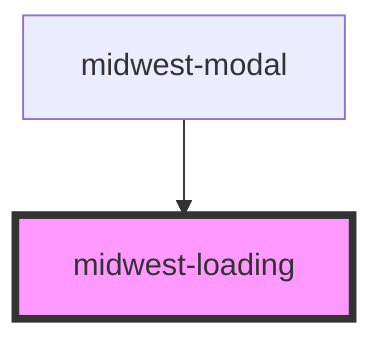

# midwest-loading

<!-- Auto Generated Below -->

## Properties

| Property  | Attribute | Description | Type      | Default     |
| --------- | --------- | ----------- | --------- | ----------- |
| `cta`     | `cta`     |             | `any`     | `undefined` |
| `error`   | `error`   |             | `string`  | `undefined` |
| `show`    | `show`    |             | `boolean` | `undefined` |
| `step`    | `step`    |             | `number`  | `0`         |
| `steps`   | `steps`   |             | `number`  | `3`         |
| `stretch` | `stretch` |             | `boolean` | `false`     |

## Dependencies

### Used by

 - [midwest-modal](../modal)

### Graph

----------------------------------------------

*Built with [StencilJS](https://stenciljs.com/)*
