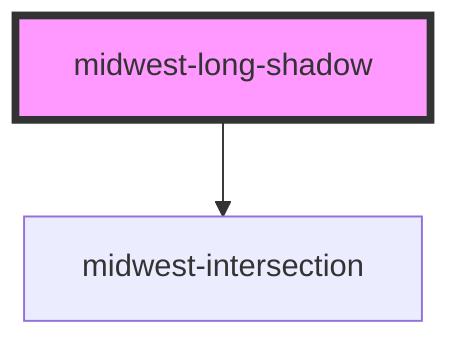

# midwest-long-shadow

<!-- Auto Generated Below -->

## Properties

| Property     | Attribute    | Description | Type                                                           | Default      |
| ------------ | ------------ | ----------- | -------------------------------------------------------------- | ------------ |
| `active`     | `active`     |             | `boolean`                                                      | `false`      |
| `complement` | `complement` |             | `boolean`                                                      | `undefined`  |
| `darkShade`  | `dark-shade` |             | `number`                                                       | `9`          |
| `delay`      | `delay`      |             | `number`                                                       | `100`        |
| `direction`  | `direction`  |             | `"bottom-left" \| "bottom-right" \| "top-left" \| "top-right"` | `'top-left'` |
| `length`     | `length`     |             | `number`                                                       | `100`        |
| `shade`      | `shade`      |             | `number`                                                       | `7`          |
| `timing`     | `timing`     |             | `number`                                                       | `50`         |

## Methods

### `in() => Promise<void>`

#### Returns

Type: `Promise<void>`

### `out() => Promise<void>`

#### Returns

Type: `Promise<void>`

## Dependencies

### Depends on

- [midwest-intersection](../intersection)

### Graph

----------------------------------------------

*Built with [StencilJS](https://stenciljs.com/)*
