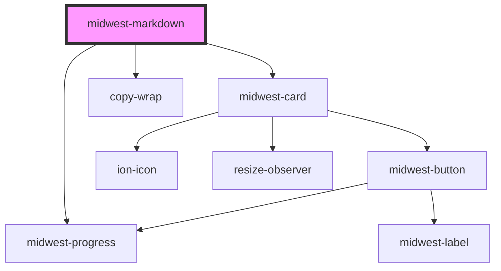

# midwest-markdown

<!-- Auto Generated Below -->

## Usage

### Default

<midwest-markdown src="https://raw.githubusercontent.com/ionic-team/stencil/master/readme.md"></midwest-markdown>

### Template

<midwest-markdown>
  <template>
# Heading
## Very cool!
- item one
- item two
- item three
  </template>
</midwest-markdown>

## Properties

| Property     | Attribute     | Description                                 | Type                                  | Default     |
| ------------ | ------------- | ------------------------------------------- | ------------------------------------- | ----------- |
| `codeString` | `code-string` | Used to set                                 | `string`                              | `undefined` |
| `editable`   | `editable`    |                                             | `boolean`                             | `false`     |
| `flavor`     | `flavor`      |                                             | `"github" \| "original" \| "vanilla"` | `"vanilla"` |
| `loading`    | `loading`     |                                             | `boolean`                             | `false`     |
| `src`        | `src`         | Used to reference an external markdown file | `string`                              | `undefined` |

## Dependencies

### Depends on

- midwest-progress
- midwest-card
- copy-wrap

### Graph

----------------------------------------------

*Built with [StencilJS](https://stenciljs.com/)*
