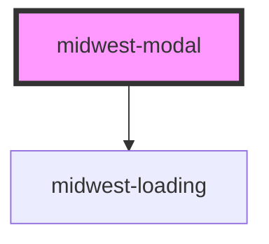

# midwest-modal

<!-- Auto Generated Below -->

## Properties

| Property  | Attribute | Description | Type      | Default |
| --------- | --------- | ----------- | --------- | ------- |
| `closing` | `closing` |             | `boolean` | `false` |
| `loading` | `loading` |             | `boolean` | `false` |
| `open`    | `open`    |             | `boolean` | `false` |
| `opening` | `opening` |             | `boolean` | `false` |
| `remote`  | `remote`  |             | `boolean` | `false` |

## Events

| Event          | Description | Type               |
| -------------- | ----------- | ------------------ |
| `modal:closed` |             | `CustomEvent<any>` |
| `modal:opened` |             | `CustomEvent<any>` |

## Dependencies

### Depends on

- [midwest-loading](../loading)

### Graph

----------------------------------------------

*Built with [StencilJS](https://stenciljs.com/)*
