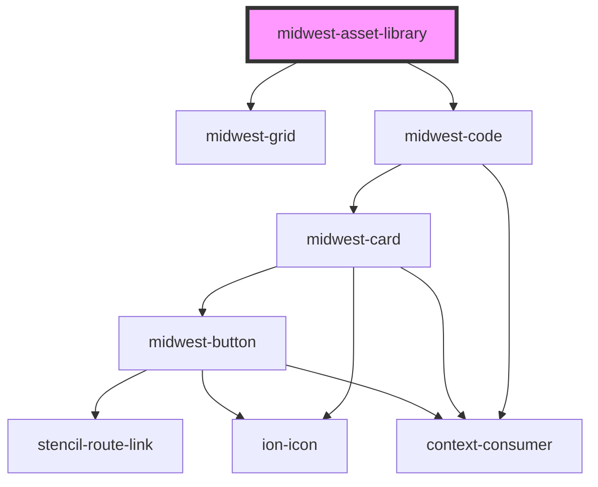

# midwest-asset-library

<!-- Auto Generated Below -->

## Dependencies

### Depends on

- [midwest-grid](../../ui/grid)
- [midwest-code](../code)

### Graph

----------------------------------------------

*Built with [StencilJS](https://stenciljs.com/)*
