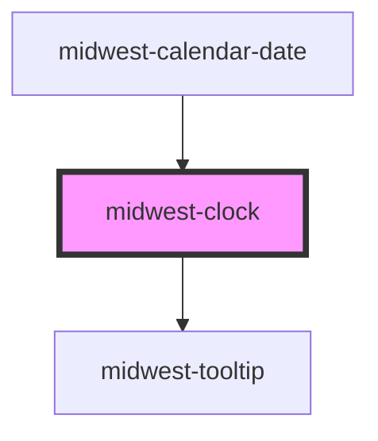

# midwest-clock

<!-- Auto Generated Below -->

## Properties

| Property   | Attribute  | Description | Type             | Default     |
| ---------- | ---------- | ----------- | ---------------- | ----------- |
| `animated` | `animated` |             | `boolean`        | `undefined` |
| `between`  | `between`  |             | `Date \| string` | `undefined` |
| `size`     | `size`     |             | `number`         | `200`       |
| `time`     | `time`     |             | `Date \| string` | `undefined` |

## Dependencies

### Used by

 - midwest-calendar-date

### Depends on

- midwest-tooltip

### Graph

----------------------------------------------

*Built with [StencilJS](https://stenciljs.com/)*
