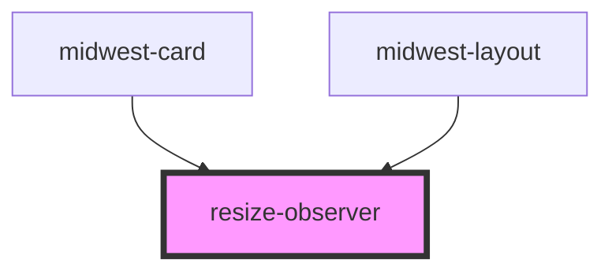

# resize-observer

<!-- Auto Generated Below -->

## Properties

| Property  | Attribute | Description | Type          | Default     |
| --------- | --------- | ----------- | ------------- | ----------- |
| `element` | --        |             | `HTMLElement` | `undefined` |

## Events

| Event     | Description | Type               |
| --------- | ----------- | ------------------ |
| `resized` |             | `CustomEvent<any>` |

## Dependencies

### Used by

 - midwest-card
 - midwest-layout

### Graph

----------------------------------------------

*Built with [StencilJS](https://stenciljs.com/)*
