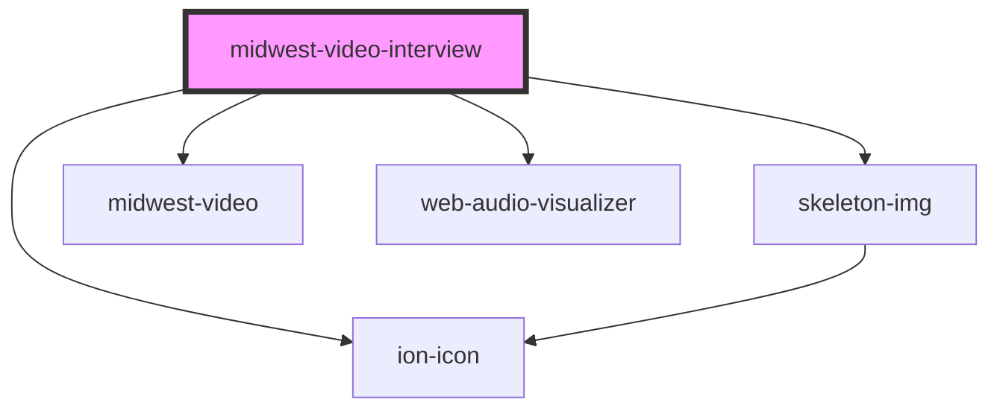

# midwest-video-interview

<!-- Auto Generated Below -->

## Properties

| Property        | Attribute       | Description | Type                                      | Default     |
| --------------- | --------------- | ----------- | ----------------------------------------- | ----------- |
| `aspectRatio`   | `aspect-ratio`  |             | `number`                                  | `100`       |
| `color`         | `color`         |             | `string`                                  | `"white"`   |
| `height`        | `height`        |             | `number`                                  | `800`       |
| `playing`       | `playing`       |             | `boolean`                                 | `undefined` |
| `src`           | `src`           |             | `string`                                  | `undefined` |
| `visualization` | `visualization` |             | `"bars" \| "bars2" \| "circle" \| "wave"` | `"bars2"`   |
| `width`         | `width`         |             | `number`                                  | `800`       |

## Methods

### `pause() => Promise<void>`

#### Returns

Type: `Promise<void>`

### `play() => Promise<void>`

#### Returns

Type: `Promise<void>`

### `skipTo(time: number) => Promise<void>`

#### Returns

Type: `Promise<void>`

### `toggle() => Promise<void>`

#### Returns

Type: `Promise<void>`

## Dependencies

### Depends on

- [skeleton-img](../skeleton-img)
- [midwest-video](../video)
- web-audio-visualizer
- ion-icon

### Graph

----------------------------------------------

*Built with [StencilJS](https://stenciljs.com/)*
