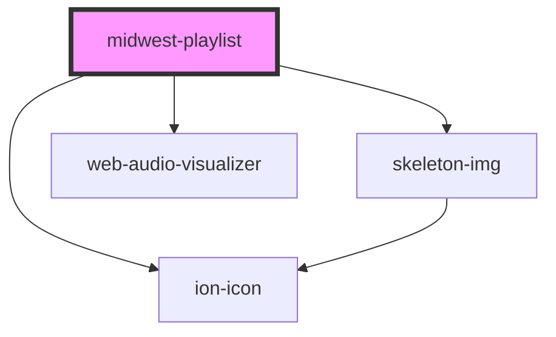

# midwest-playlist

<!-- Auto Generated Below -->

## Usage

### Default

<midwest-playlist>
	<midwest-song src="https://ui.splitinfinities.com/audio/playlist/01%20The%20Leaves%20Were%20Falling.mp3">
	</midwest-song>
	<midwest-song src="https://ui.splitinfinities.com/audio/playlist/02%20Because%20I'm%20Me.mp3">
	</midwest-song>
	<midwest-song src="https://ui.splitinfinities.com/audio/playlist/03%20Frankie%20Sinatra.mp3"></midwest-song>
	<midwest-song src="https://ui.splitinfinities.com/audio/playlist/04%20Subways.mp3"></midwest-song>
	<midwest-song src="https://ui.splitinfinities.com/audio/playlist/05%20Going%20Home.mp3"></midwest-song>
	<midwest-song src="https://ui.splitinfinities.com/audio/playlist/06%20If%20I%20Was%20a%20Folkstar.mp3">
	</midwest-song>
	<midwest-song src="https://ui.splitinfinities.com/audio/playlist/07%20Colours.mp3"></midwest-song>
	<midwest-song src="https://ui.splitinfinities.com/audio/playlist/08%20Zap!.mp3"></midwest-song>
	<midwest-song src="https://ui.splitinfinities.com/audio/playlist/09%20The%20Noisy%20Eater.mp3">
	</midwest-song>
	<midwest-song src="https://ui.splitinfinities.com/audio/playlist/10%20Wildflower.mp3"></midwest-song>
	<midwest-song src="https://ui.splitinfinities.com/audio/playlist/11%20Harmony.mp3"></midwest-song>
	<midwest-song src="https://ui.splitinfinities.com/audio/playlist/12%20Live%20a%20Lifetime%20Love.mp3">
	</midwest-song>
	<midwest-song src="https://ui.splitinfinities.com/audio/playlist/13%20Park%20Music.mp3"></midwest-song>
	<midwest-song
			src="https://ui.splitinfinities.com/audio/playlist/14%20Livin'%20Underwater%20(Is%20Somethin'%20Wild).mp3">
	</midwest-song>
	<midwest-song src="https://ui.splitinfinities.com/audio/playlist/15%20The%20Wozard%20of%20Iz.mp3">
	</midwest-song>
	<midwest-song src="https://ui.splitinfinities.com/audio/playlist/16%20Over%20the%20Turnstiles.mp3">
	</midwest-song>
	<midwest-song src="https://ui.splitinfinities.com/audio/playlist/17%20Sunshine.mp3"></midwest-song>
	<midwest-song src="https://ui.splitinfinities.com/audio/playlist/18%20Light%20Up.mp3"></midwest-song>
	<midwest-song src="https://ui.splitinfinities.com/audio/playlist/19%20Kaleidoscope%20Lovers.mp3">
	</midwest-song>
	<midwest-song src="https://ui.splitinfinities.com/audio/playlist/20%20Stepkids.mp3"></midwest-song>
	<midwest-song src="https://ui.splitinfinities.com/audio/playlist/21%20Saturday%20Night%20Inside%20Out.mp3">
	</midwest-song>
	<midwest-song
			src="https://ui.splitinfinities.com/audio/playlist/22%20Frankie%20Sinatra%20(Extended%20Mix).mp3">
	</midwest-song>
</midwest-playlist>

## Properties

| Property             | Attribute             | Description | Type                                      | Default      |
| -------------------- | --------------------- | ----------- | ----------------------------------------- | ------------ |
| `artwork`            | `artwork`             |             | `boolean`                                 | `false`      |
| `autoplay`           | `autoplay`            |             | `boolean`                                 | `false`      |
| `dark`               | `dark`                |             | `boolean`                                 | `false`      |
| `load`               | `load`                |             | `boolean`                                 | `false`      |
| `loading`            | `loading`             |             | `boolean`                                 | `false`      |
| `name`               | `name`                |             | `string`                                  | `"Playlist"` |
| `playing`            | `playing`             |             | `boolean`                                 | `false`      |
| `playlist`           | `playlist`            |             | `"hide" \| "show"`                        | `"show"`     |
| `remember`           | `remember`            |             | `boolean`                                 | `true`       |
| `view`               | `view`                |             | `"art" \| "playlist"`                     | `"playlist"` |
| `visualizationColor` | `visualization-color` |             | `string`                                  | `"gray"`     |
| `visualizationType`  | `visualization-type`  |             | `"bars" \| "bars2" \| "circle" \| "wave"` | `"bars"`     |

## Events

| Event        | Description | Type               |
| ------------ | ----------- | ------------------ |
| `load_songs` |             | `CustomEvent<any>` |

## Methods

### `next() => Promise<void>`

#### Returns

Type: `Promise<void>`

### `pause() => Promise<void>`

#### Returns

Type: `Promise<void>`

### `play(skipDefault?: boolean) => Promise<void>`

#### Returns

Type: `Promise<void>`

### `prepare(element: any) => Promise<void>`

#### Returns

Type: `Promise<void>`

### `previous() => Promise<void>`

#### Returns

Type: `Promise<void>`

## Dependencies

### Depends on

- ion-icon
- [skeleton-img](../skeleton-img)
- web-audio-visualizer

### Graph

----------------------------------------------

*Built with [StencilJS](https://stenciljs.com/)*
