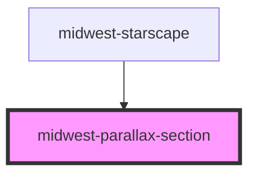

# midwest-parallax-section

<!-- Auto Generated Below -->

## Properties

| Property | Attribute | Description | Type     | Default |
| -------- | --------- | ----------- | -------- | ------- |
| `speed`  | `speed`   |             | `number` | `1`     |

## Dependencies

### Used by

 - [midwest-starscape](../starscape)

### Graph

----------------------------------------------

*Built with [StencilJS](https://stenciljs.com/)*
