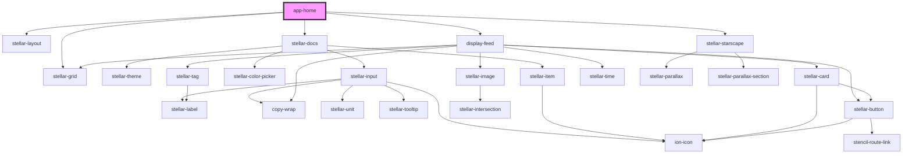

# app-home

<!-- Auto Generated Below -->

## Dependencies

### Depends on

- stellar-layout
- [stellar-docs](../docs)
- stellar-grid
- [display-feed](../display-feed)
- stellar-starscape

### Graph

----------------------------------------------

*Built with [StencilJS](https://stenciljs.com/)*
