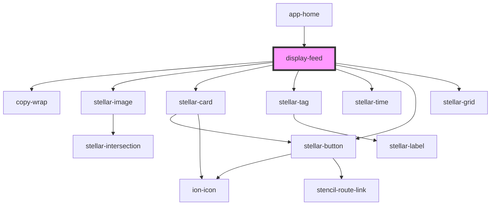

# display-feed

<!-- Auto Generated Below -->

## Properties

| Property    | Attribute    | Description | Type     | Default         |
| ----------- | ------------ | ----------- | -------- | --------------- |
| `filter`    | `filter`     |             | `string` | `"popular"`     |
| `icon`      | `icon`       |             | `string` | `"logo-github"` |
| `iconColor` | `icon-color` |             | `string` | `"blue"`        |
| `type`      | `type`       |             | `string` | `"stellar"`     |

## Dependencies

### Used by

 - [app-home](../app-home)

### Depends on

- copy-wrap
- stellar-image
- stellar-card
- stellar-tag
- stellar-time
- stellar-button
- stellar-grid

### Graph

----------------------------------------------

*Built with [StencilJS](https://stenciljs.com/)*
